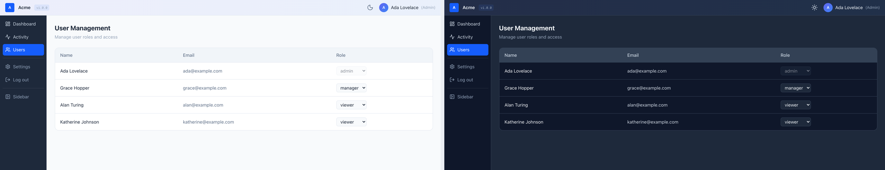
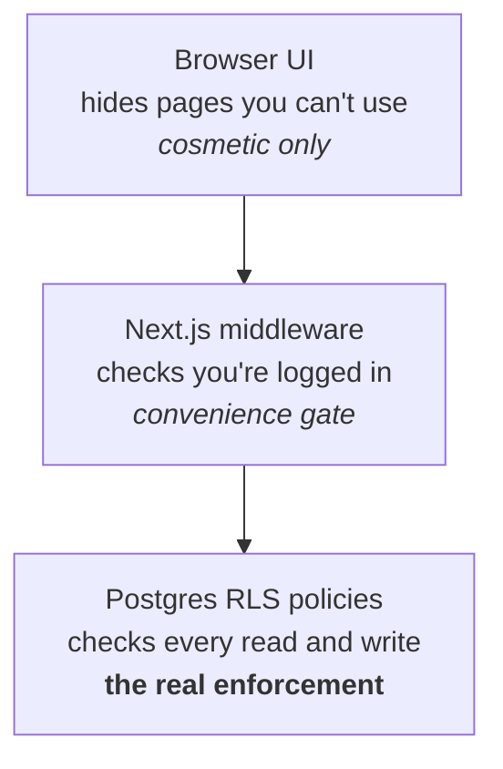
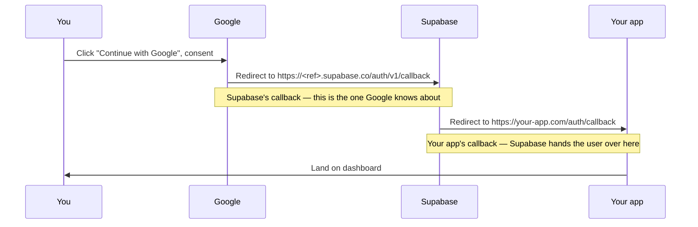
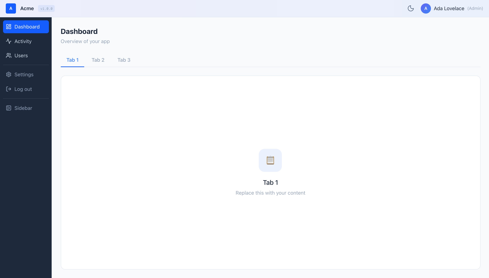
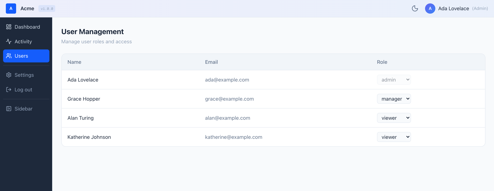

# webapp-template

> AI lets anyone prototype an app in an afternoon. Almost nobody ships a *secure* one. This is the production-grade shell you build your idea on top of.

[](https://github.com/faiyazpilot/webapp-template/actions/workflows/ci.yml)
[](LICENSE)
[](CONTRIBUTING.md)



**Who this is for:**

- You're prototyping with **Claude, Cursor, or v0** and want a real foundation instead of throwaway demo code.
- You need **real login and user roles** — not a fake "logged in as Admin" button that anyone can flip.
- You want to **deploy to a real URL today** and start sharing it.

> **Not a developer?** Read [BLUEPRINT.md](BLUEPRINT.md) instead — it's a step-by-step guide written for non-technical builders, with copy-paste AI prompts for every feature and phase.

---

## What you get

- **Google sign-in** — users log in with their Google account; you never store or handle passwords.
- **Three roles — admin / manager / viewer — enforced by the database (RLS), not just hidden in the UI.** Hiding a button is decoration; the database refusing the write is the actual lock.
- **New sign-ins become `viewer` automatically, via a database trigger** — so the rule holds even if someone bypasses your app and calls the API directly.
- **Admin user-management page** — admins change anyone's role from a dropdown; managers can view the list read-only.
- **App shell** — top bar + collapsible sidebar, ready for your own pages.
- **Light / dark mode** — follows the system setting, with a manual toggle.
- **Dashboard, Activity, and Settings scaffolds** — placeholder pages to replace with your idea.
- **Security headers + Content-Security-Policy** preconfigured.
- **Open-redirect-safe auth callback** — login can only ever send users to a page inside your own app.
- **CI already wired** — lint, type-check, tests, and build run on every pull request.

## Stack

| Layer | Choice |
|---|---|
| Framework | Next.js 16 (App Router) |
| Language | TypeScript |
| Styling | Tailwind CSS v4 |
| Auth + DB | Supabase |
| Hosting | Vercel (recommended) |
| Tests | Vitest |

---

## How the security works

This is the part most AI-built apps get wrong. Read it once — it's the difference between a demo and something you can actually put real users on.

**1. "Wait, the database key is in the browser?"** Yes — on purpose. The key shipped to the browser (Supabase calls it the *anon* or *publishable* key) is like a lobby key card: it gets you to the front desk, but every single row in every table has its own lock on top of it. Those locks are **RLS policies** — rules that live *inside* Postgres and decide who may read or change each row. The all-powerful `service_role` key, which can ignore those locks, **never appears anywhere in this template.**

**2. "What if someone opens DevTools and calls the API directly?"** They can — and the database still says no. Concretely: an attacker copies the public key out of the page and sends a request to the REST API trying to set their own `role` to `admin`. Postgres rejects it. Why? Because role rows can *only* be created by a trusted database trigger, and *only* an existing admin is allowed to change one. The UI hiding the admin page is cosmetic. **The database refusing the write is the security.**

**3. The three layers.** Each does a job; only the last one is load-bearing.



**4. The login flow — and the two callbacks that confuse everyone.**



> **Two different callbacks exist. Google only ever knows about Supabase's.** This trips up almost everyone during setup — keep it in mind for Part 2.

---

## Set it up (~20 minutes)

**Before you start, create these free accounts (no credit card needed):**

- A **Google account** (you almost certainly have one).
- A free **Supabase** account — [supabase.com](https://supabase.com)
- A free **Vercel** account — [vercel.com](https://vercel.com) (only needed for Part 6)
- **Node.js 20 or newer** installed — check with `node -v`. Get it at [nodejs.org](https://nodejs.org).

Do the parts in order. Each one names the exact buttons and labels you'll click.

### Part 0 — Get the code

1. On the [GitHub repo](https://github.com/faiyazpilot/webapp-template), click the green **Use this template** button → **Create a new repository**. (Or, if you prefer the command line: `git clone https://github.com/faiyazpilot/webapp-template.git`.)
2. Open the folder in your terminal and install dependencies:
   ```bash
   npm install
   ```
3. You need **Node 20+** for this to work. If `npm install` errors, run `node -v` and upgrade if it's below 20.

### Part 1 — Create a Supabase project

1. Go to [supabase.com](https://supabase.com) → sign in → **New project**.
2. Give it a **Name**, set a **Database Password** (save it somewhere — you won't need it for this template, but you can't see it again), and pick a **Region** near you. Click **Create new project**.
3. Wait ~2 minutes while it provisions.
4. Go to **Project Settings → API**. Copy two values:
   - **Project URL** — looks like `https://abcdefgh.supabase.co`
   - The **anon** / **publishable** key — Supabase shows one or the other name depending on your project; either way it's the public-safe key meant for browsers.
5. Note your **project ref**: it's the subdomain of your Project URL. In `https://abcdefgh.supabase.co`, the ref is `abcdefgh`. **Write it down — you need it in Part 2.**

### Part 2 — Google Cloud OAuth (take your time here)

<details>
<summary><b>Expand the careful, step-by-step Google setup</b></summary>

This is the fiddliest part. Go slowly and the rest is easy.

1. Go to [console.cloud.google.com](https://console.cloud.google.com) → create a new project (top-left project dropdown → **New Project**).
2. Open the **OAuth consent screen** (newer Google dashboards label this **Google Auth Platform**):
   - **Audience:** choose **External**.
   - Fill in the **App name**, a **User support email**, and a **Developer contact** email.
   - Leave the **scopes** at the defaults — you don't need to add any.
   - **Testing mode is fine while it's just you.** Add your own Gmail under **Test users**. Until you publish the app, *only* the emails you list as test users can sign in.
3. Go to **Credentials → Create credentials → OAuth client ID**:
   - **Application type:** **Web application**.
   - **Authorized JavaScript origins:** add `https://<your-project-ref>.supabase.co`
   - **Authorized redirect URIs:** add `https://<your-project-ref>.supabase.co/auth/v1/callback`

   > **This is Supabase's callback URL, not your app's.** Your app's `/auth/callback` never goes into Google. Google hands the user to Supabase, and Supabase hands them to your app. Putting `http://localhost:3000/auth/callback` here is the #1 cause of the `redirect_uri_mismatch` error — don't do it.

4. Click **Create** and copy the **Client ID** and **Client secret**.
5. Back in the **Supabase Dashboard → Authentication → Sign In / Providers → Google**: toggle it **on**, paste the **Client ID** and **Client secret**, and click **Save**.

</details>

### Part 3 — Environment variables

1. Make your local config file (it's gitignored, so your keys never get committed):
   ```bash
   cp .env.example .env.local
   ```
2. Open `.env.local` and paste in the two values from Part 1 (the Project URL and the anon/publishable key).
3. The `NEXT_PUBLIC_` prefix means a value is **visible in the browser on purpose** — that's expected and safe for these two values. ([Here's why](#how-the-security-works).) Never put a secret key behind a `NEXT_PUBLIC_` name.
4. **If `npm run dev` is already running, stop it and restart** — environment values are read at startup.

### Part 4 — Run the database schema

1. In Supabase, go to **SQL Editor → New query**.
2. Open `supabase-schema.sql` from this repo, copy **all** of it, paste it into the editor, and click **Run**.
3. You should see **"Success. No rows returned."**
4. Confirm it worked: go to **Table Editor** — you should now see an `app_roles` table.

This one file sets up everything the security depends on: the `app_roles` table, the RLS policies, the `is_admin()` helper function, and the trigger that gives every new sign-in a `viewer` row automatically.

> **Already ran an older version? Just re-run this file — it upgrades in place** (it drops the old policies and recreates everything safely; your data is untouched).

### Part 5 — Run locally

1. **Before your first login**, go to **Supabase → Authentication → URL Configuration → Redirect URLs** and add:
   ```
   http://localhost:3000/auth/callback
   ```
2. Start the app:
   ```bash
   npm run dev
   ```
3. Open [http://localhost:3000](http://localhost:3000), click **Continue with Google**, sign in, and you'll land on the dashboard as a **viewer**.

   

### Part 6 — Deploy to Vercel

<details>
<summary><b>Expand the deploy + production-URL steps</b></summary>

1. Go to [vercel.com](https://vercel.com) → **Add New… → Project** → **Import** your GitHub repo.
2. Before clicking Deploy, expand **Environment Variables** and add your two values (`NEXT_PUBLIC_SUPABASE_URL` and `NEXT_PUBLIC_SUPABASE_ANON_KEY`). Apply them to **all environments**. **Add them now** — adding them later means a redeploy.
3. Click **Deploy** and wait for it to finish. You'll get a URL like `https://your-app.vercel.app`.
4. Tell Supabase about the new URL — **Supabase → Authentication → URL Configuration**:
   - Set **Site URL** to `https://your-app.vercel.app`
   - Add `https://your-app.vercel.app/auth/callback` to **Redirect URLs**
   - *(Optional)* To let Vercel **preview deployments** log in too, also add a wildcard like `https://your-app-*.vercel.app/auth/callback`.
5. **Custom domain?** Add it in **Vercel → Settings → Domains**, then repeat step 4's Supabase URL additions with your real domain.

> Two things people forget: (a) changing a Vercel env var requires a **redeploy** to take effect, and (b) your Google consent screen is still in **Testing mode**, so only your listed test users can log in until you publish it.

</details>

### Part 7 — Make yourself admin

New accounts start as `viewer`, including yours. Promote yourself one of two ways:

- **Easy way (UI):** Supabase → **Table Editor → `app_roles`** → find your row → change `role` to `admin` → **Save**.
- **SQL way:** Supabase → SQL Editor → run:
  ```sql
  update app_roles set role = 'admin' where email = 'you@gmail.com';
  ```

Refresh the app and the admin navigation (the **Users** page) appears. It's deliberately manual — there's no automatic "first user becomes admin" rule, which avoids a race where the wrong person could grab admin during signup.

---

## Customizing

| What you want to change | Where |
|---|---|
| App name (top bar, sidebar, login, browser tab) | `.env.local` → `NEXT_PUBLIC_APP_NAME` |
| Sidebar navigation | `navItems` / `adminNavItems` in `src/components/AppShell.tsx` |
| Dashboard tabs | `TABS` in `src/app/dashboard/page.tsx` |
| Theme colors | CSS variables at the top of `src/app/globals.css` — change `--accent`, `--sidebar-bg`, etc. |
| Font | Replace the `Geist` import in `src/app/layout.tsx` with any [Google Font](https://fonts.google.com) |
| Logo | Replace the `{/* Placeholder logo */}` blocks in `AppShell.tsx` and `src/app/login/page.tsx` with `` and drop your file in `public/` |
| Favicon | Replace `public/favicon.ico` — convert any PNG at [favicon.io](https://favicon.io) |
| Social card (link preview image) | Replace `public/og.png` with a 1200×630 PNG |
| Page metadata (title, description) | `src/app/layout.tsx` |
| **Add a new page** | Create `src/app/<name>/page.tsx`, add it to `navItems` — the middleware protects it automatically |
| **Add a new table** | Enable RLS + write policies (copy the pattern in `supabase-schema.sql`) before any client code touches it |

> For a complete branding and feature-building walkthrough with AI prompts, see [BLUEPRINT.md](BLUEPRINT.md).

> Using **Claude Code** or **Cursor**? `CLAUDE.md` gives your AI assistant full project context — edit it as your app grows so the AI stays accurate.

## Role system

| Role | Can do |
|---|---|
| **admin** | See everything, *and* change other users' roles |
| **manager** | Read the user list (read-only — no role changes) |
| **viewer** | Dashboard only |

> Enforced in Postgres via RLS — the UI checks are just for niceness. If a viewer hand-crafts an API request to read the user list, Postgres still says no.

Admins manage roles right from the **Users** page (an admin can't change their own role, so you can't accidentally lock yourself out):



## Troubleshooting

| Symptom | Likely cause | Fix |
|---|---|---|
| `redirect_uri_mismatch` from Google | Wrong redirect URI in Google credentials | In Google → Credentials, the redirect URI must be `https://<ref>.supabase.co/auth/v1/callback` — **Supabase's** URL, not your app's. |
| Bounced back to login: "Authentication failed" | Your app's `/auth/callback` isn't allowed in Supabase | Add `http://localhost:3000/auth/callback` (and your prod URL) under Supabase → Authentication → URL Configuration → Redirect URLs. |
| Works locally, but Vercel sends you to `localhost` | Supabase **Site URL** is still localhost | Set Site URL to your `https://your-app.vercel.app` in Supabase → URL Configuration. |
| "App configuration error" | Env vars missing or mistyped | Check `.env.local` (local) or your Vercel env vars, then restart/redeploy. |
| Stuck spinner, or "not set up yet" / "not authorized" | The database schema hasn't been run | Run `supabase-schema.sql` in the Supabase SQL Editor (Part 4). |
| "Access blocked: app not verified", or a second account can't log in | Consent screen is in Testing mode | Add that person under Test users, or publish the consent screen in Google. |
| Changed an env value and nothing happened | `NEXT_PUBLIC_*` values are baked in at start/build time | Restart `npm run dev` locally, or redeploy on Vercel. |
| Users page is empty | You're a viewer, or on an old schema | Only admins/managers see users; promote yourself (Part 7) and re-run the schema. |
| Changed someone's role but their screen is stale | Roles are loaded once, at sign-in | Have them refresh the page (or sign out and back in). |
| Login page never appears / blank screen | Dev server not running, or wrong Node version | Run `npm run dev`; confirm `node -v` is 20 or newer. |

---

## Contributing

PRs welcome — see [CONTRIBUTING.md](CONTRIBUTING.md) and the [Code of Conduct](CODE_OF_CONDUCT.md). Have a question? See [SUPPORT.md](SUPPORT.md).

## Security

Found a vulnerability? See [SECURITY.md](SECURITY.md) — please **don't** open a public issue.

## Free tier limits

| Service | Free limit | What happens after |
|---|---|---|
| Supabase | 2 active projects, 500 MB database, 5 GB bandwidth/month | Project pauses after 1 week of inactivity; paid plan ~$25/month |
| Vercel | 100 GB bandwidth/month, 6,000 build minutes/month | Email warning; rarely an issue for early-stage apps |
| Google OAuth | Unlimited | Consent screen stays in Testing mode until you publish it (only your listed test users can log in until then) |

## Known gaps

Things that are missing and matter — documented here so you're not surprised:

- **No external API pattern.** There are no Next.js API routes (`/api/`) in the template. Any call to a third-party service (Stripe, email, AI APIs) that requires a secret key must go server-side — calling it from the browser exposes the key. Until a worked example lands, see [BLUEPRINT.md § "Connecting to external services"](BLUEPRINT.md#1-connecting-to-external-services-stripe-hubspot-email-apis-ai-apis) for the prompt to use with AI.
- **No data-querying guide.** The two Supabase clients (browser vs. server) are undocumented. There is also a silent failure mode when a database security rule (RLS) blocks a write — it returns an empty array instead of an error. See [BLUEPRINT.md § "Querying your own data"](BLUEPRINT.md#2-querying-your-own-data--the-pattern-and-a-known-trap) for the correct pattern.
- **No MFA.** Authentication relies entirely on Google OAuth. Users who want a second factor should enable 2FA on their Google account. In-app TOTP MFA is not implemented.

## Roadmap

No dates — this is open source with limited maintainer bandwidth. Suggest priorities in [Discussions](https://github.com/faiyazpilot/webapp-template/discussions) or open a PR:

- Worked example: server-side API route calling an external service (e.g. Resend for email).
- Magic-link / passwordless email login alongside Google.
- Audit-log example wired up to the Activity page.
- More OAuth providers (GitHub, Microsoft).
- Real-time data with Supabase channel subscriptions.

## License

[MIT](LICENSE) — free to use, modify, and build on.
